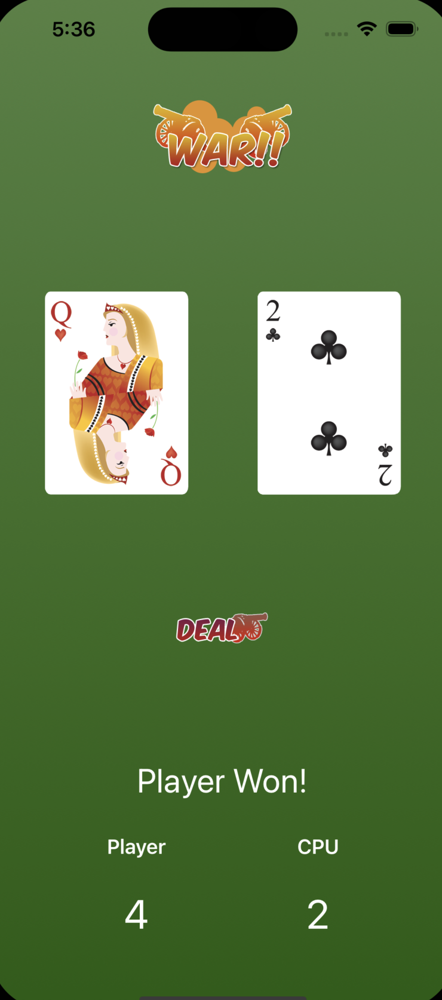
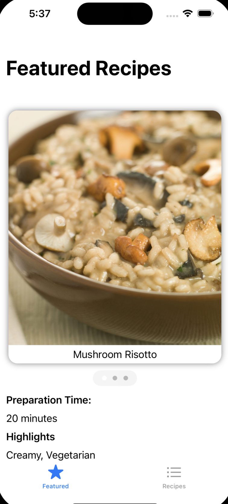
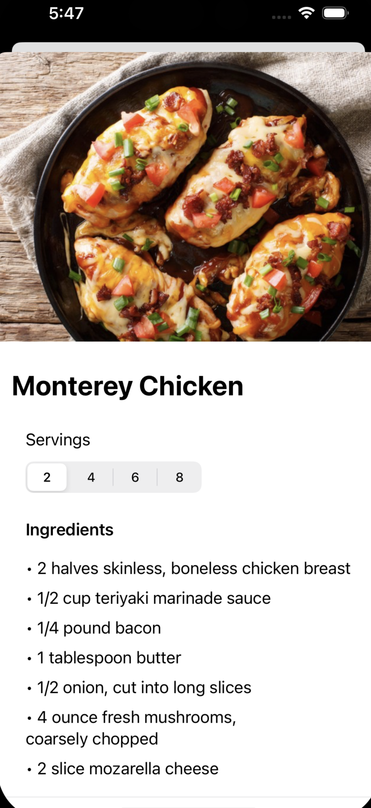
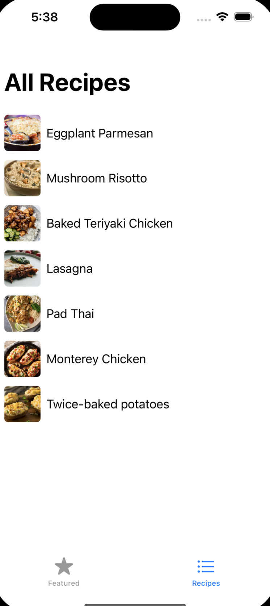
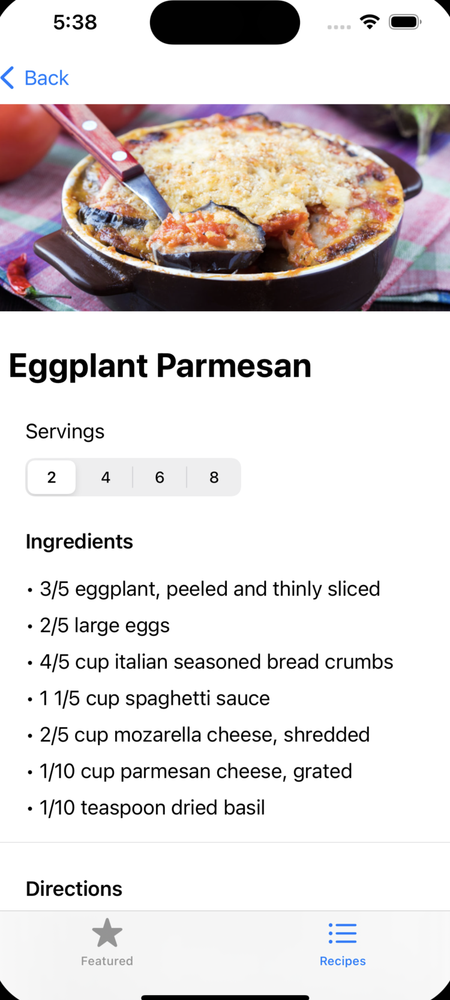
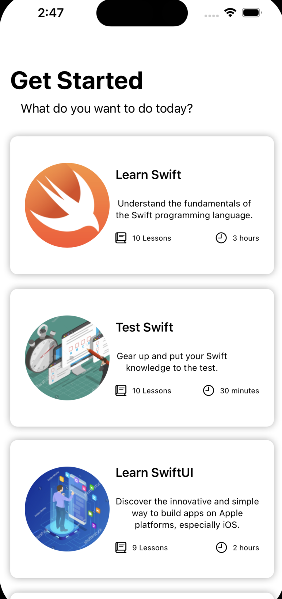
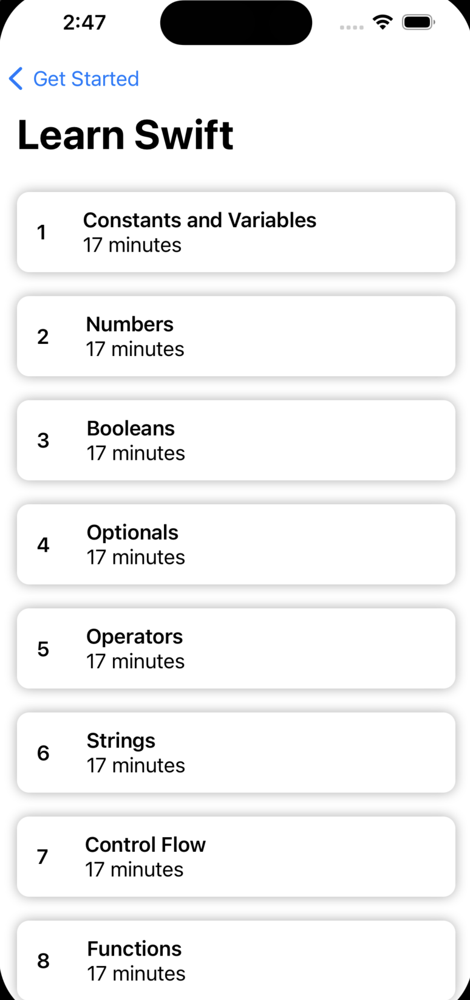
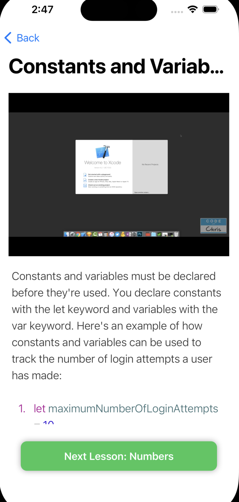
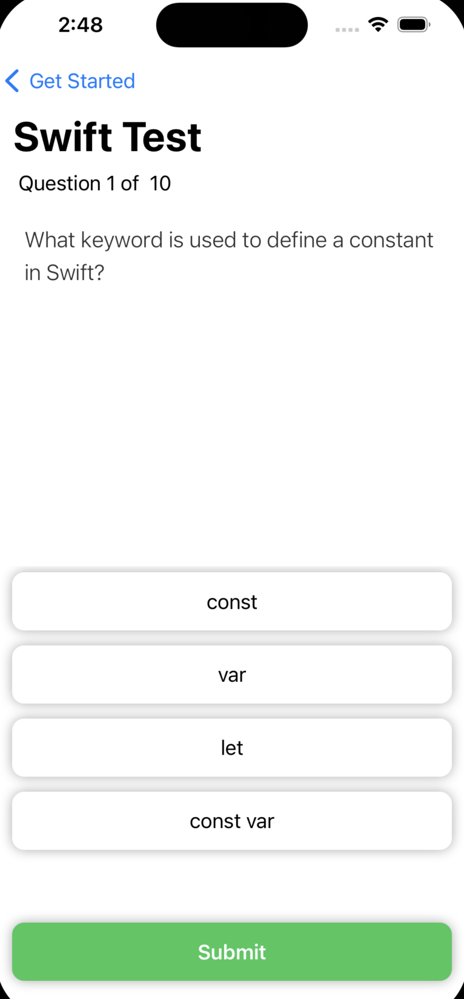

# iOS Applications

This repo contains a collection of basic iOS applications that were used to practice iOS developmental skills.

## App 1: War Card Game

[code](1-Card-Game/)

## App 2: Recipes App

[code](2-Recipes/)

  
  &nbsp;
  
  &nbsp;
   
  &nbsp;
  

## App 3: Learning App

[code](3-Learning/)

  
  &nbsp;
  
  &nbsp;
   
  &nbsp;
  

## Author

__Jacob Summerville__

&rarr; _Coding lessons followed at [codewithchris.com](https://codewithchris.com/)_