# iOS Applications

This repo contains a collection of basic iOS applications that were used to practice iOS developmental skills.

## App 1: War Card Game

[code](1-Card-Game/)

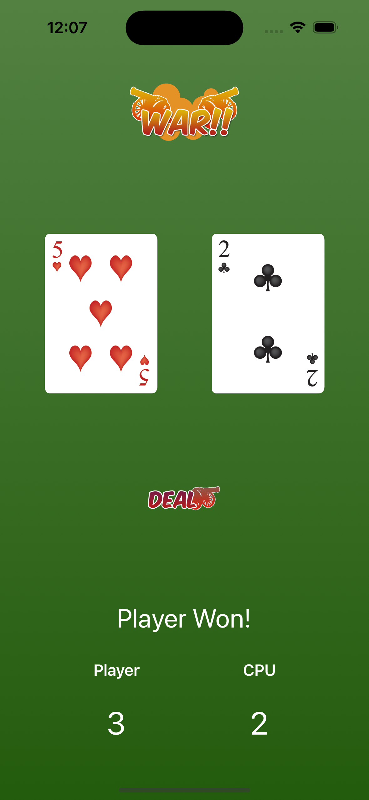

## App 2: Recipes App

[code](2-Recipes/)

  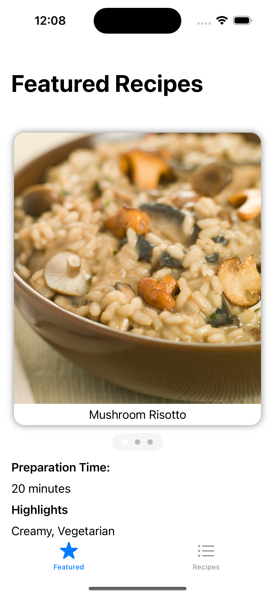
  &nbsp;
  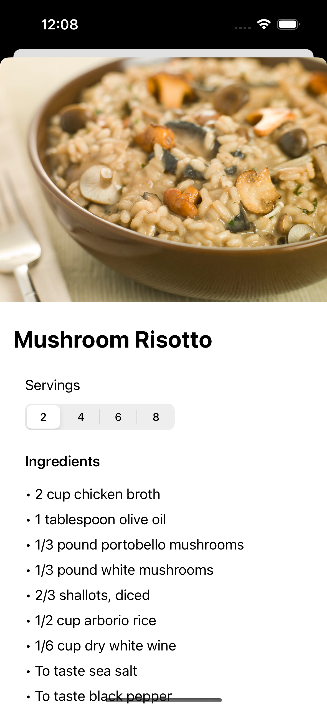
  &nbsp;
   
  &nbsp;
  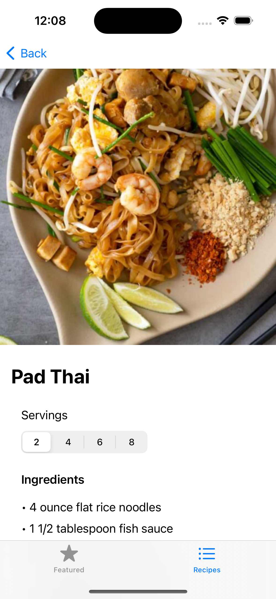

## App 3: Learning App

[code](3-Learning/)

  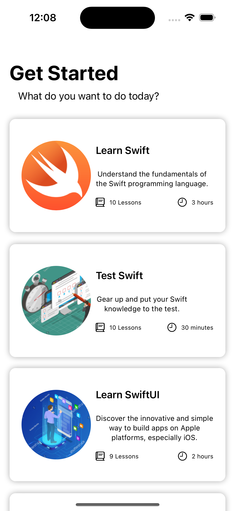
  &nbsp;
  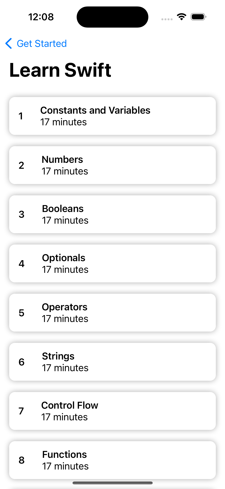
  &nbsp;
  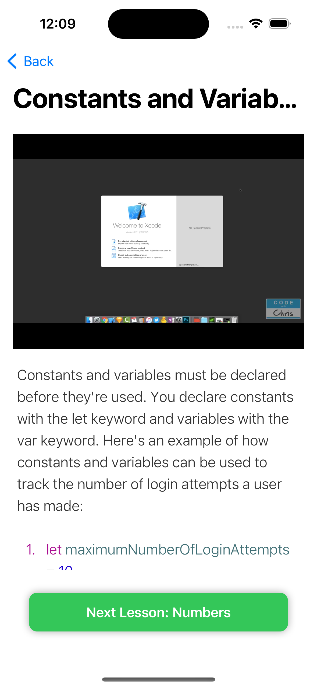 
  &nbsp;
  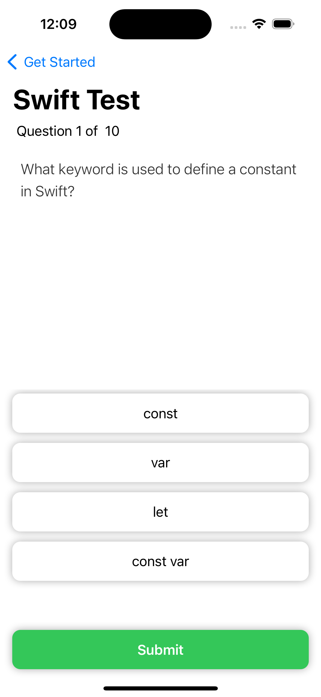
  &nbsp;
  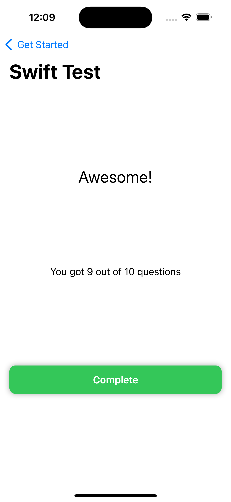

## App 4: City Sights App

[code](4-City-Sights/)

API: [https://fusion.yelp.com/](https://fusion.yelp.com/)

Note: YelpAPI key file was not committed. To reproduce this project, it will need to be added. You can reference YelpAPI_Sample to do this.

  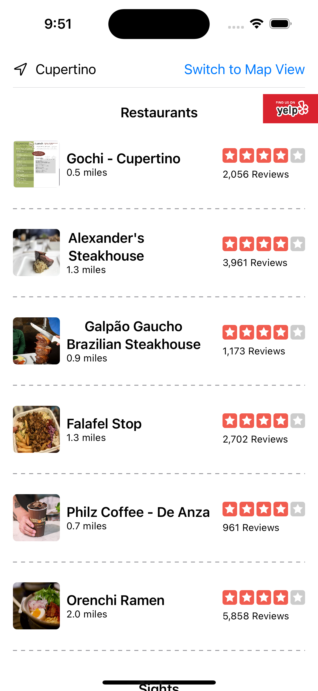
  &nbsp;
  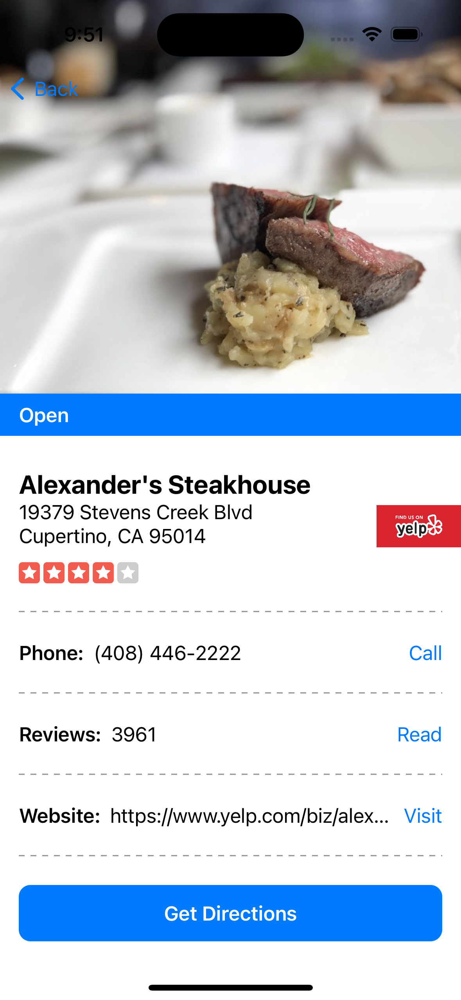
  &nbsp;
  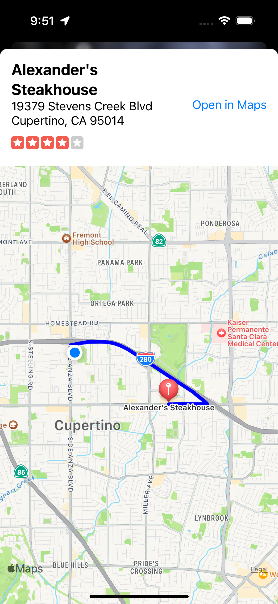 
  &nbsp;
  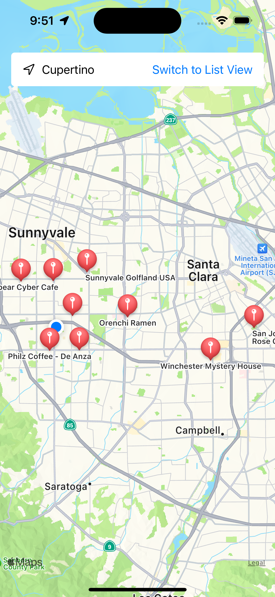
  &nbsp;
  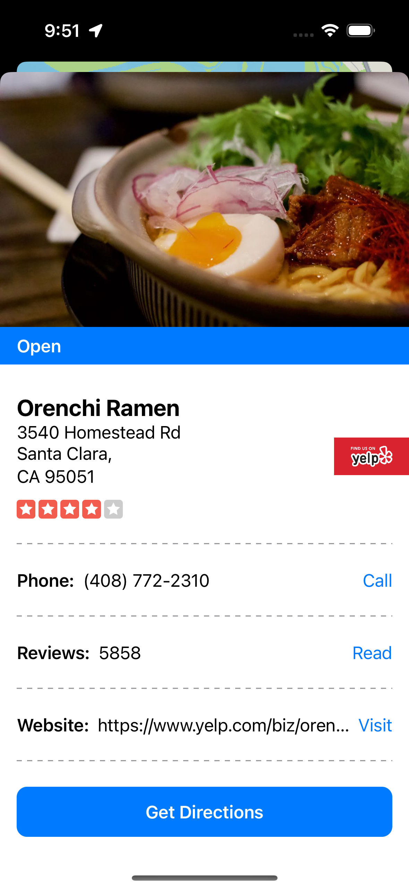

## App 5: Firebase Demo

[code](5-Firebase-Demo/)

Resources:
- [Firebase](https://firebase.google.com/)
- [Cocoa Pods](https://cocoapods.org/)

## Author

__Jacob Summerville__

&rarr; _Coding lessons followed at [codewithchris.com](https://codewithchris.com/)_